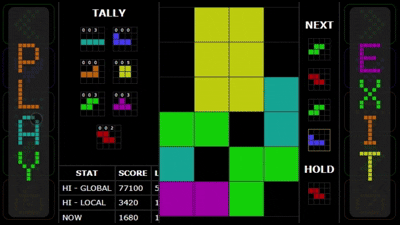

# Description
This project is a video game heavily inspired by the classic game Tetris.

What sets Grid Stacker apart from most other Tetris-inspired games is the degree of customisation, allowing the user to pick the size of the grid and to choose which blocks they'll be facing. 

This level of customisation results in over 16,000 different game configurations. Local high-scores are maintained on your device for each of these 16,000 game modes, in addition to the global high-score system.

A major complaint I have with most iterations of Tetris is that the games can tend to drag on for a significant amount of time. This isn't necessarily a problem, but it restricts the user's ability to play the game, such as if they're short on time. With Grid Stacker, the user can choose smaller grid sizes, such as 7x4, as opposed to the traditional 20x10, which not only offers interesting new gameplay experiences, but also significantly shortens the length of the game.

# Example 

# Where To Play
This project has been deployed on the [web](https://www.grid-stacker.com/) and can be played on any device with a modern web browser. 

Installing the app as a PWA will offer a better gaming experience. The game also doesn't require an internet connection to play, assuming it's already installed on your device.

# Note for iOS/MAC Users
The game's sound effects seem to result in poor performance on iOS devices, in addition to the volume being excessively high. For now, sound effects have been disabled on both iOS and MAC devices (note: MAC devices haven't been tested yet).

This isn't ideal of course, as the 'typewriter' sound effects are rather satisfying, so I'd recommend an Android or Windows device for the full experience.

Another issue I've experience with iOS devices is that the slider component doesn't work as expected: you can still get it to work by clicking along the slider's length, but you can't use a 'drag' gesture as one would expect from a slider.